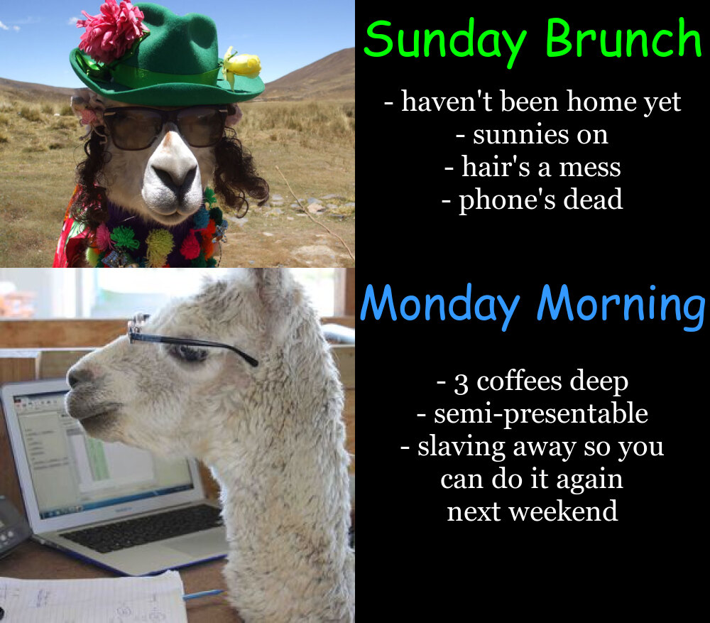

# Assignment 1 - meme.R

## Part A:
- Set-up an appropriate GitHub account and course repository.
- Develop an original meme using R markdown, including the magick package.

**My meme:**

**Motivation for my meme:**

*2x2 format* - This format allows the user to utilise more than one tense, making it eaiser to convey complex ideas or stories.

*Llamas* - As my colleagues use R in their professional projects, I aim to share this meme with them. We have a long-running joke about llamas in the office, and since the best memes tend to have animals, I thought this would be the perfect choice of animal to use in my meme.

*Content* - I wanted my meme to be interpretable to the majority of people. Most people should be able to relate to the content used in my meme, either through lived experience or through exposure to similar concepts via social media. The images used are funny on their own, so even if the text content evokes a "cringe" feeling from the viewer (possibly from relating to the mentioned experience), they should still find the meme entertaining. I used Comic Sans for my text headers as this font is widely regarded for being used in memes. I made sure to use font colours which ensure the text can be easily read and which feature in the images. I removed unneccessary white-space from the images and ensured that all text fit nicely to utilise the shape space. I believe the overall styling of my meme is in-line with other memes of the same format. 

**Code creation of my meme:**

library(magick)

party_llama <- image_read("https://i.imgflip.com/tr8f3.jpg") %>%
  image_scale(500)

work_llama <- image_read("http://www.pinjarraalpacas.com.au/content/image/full/Resources_Alpaca-at-Work---Pinjarra-Alpacas-For-Sale_44.jpg") %>%
  image_scale(500)

party_text <- image_blank(width = 500, height = 377, color = "#000000") %>%
  image_annotate(text = "Sunday Brunch", color = "#00FF00", size = 70, font = "Comic Sans MS", gravity = "north") %>%
  image_annotate(text = "\n- haven't been home yet\n- sunnies on\n- hair's a mess\n- phone's dead", color = "#FFFFFF", size= 40, font = "Georgia", gravity = "center") 

work_text <- image_blank(width = 500, height = 500, color = "#000000") %>%
  image_annotate(text = "Monday Morning", color = "#3398FF", size = 65, font = "Comic Sans MS", gravity = "north") %>%
  image_annotate(text = "- 3 coffees deep\n- semi-presentable\n- slaving away so you\ncan do it again\nnext weekend", color = "#FFFFFF", size = 40, font = "Georgia", gravity = "center")

first_row <- c(party_llama, party_text) %>%
  image_append()

second_row <- c(work_llama, work_text) %>%
  image_append()

meme <- c(first_row, second_row) %>%
  image_append(stack = TRUE)

image_write(meme, "my_meme.png")party_llama <- image_read("https://i.imgflip.com/tr8f3.jpg") %>%
  image_scale(500)

work_llama <- image_read("http://www.pinjarraalpacas.com.au/content/image/full/Resources_Alpaca-at-Work---Pinjarra-Alpacas-For-Sale_44.jpg") %>%
  image_scale(500)

party_text <- image_blank(width = 500, height = 377, color = "#000000") %>%
  image_annotate(text = "Sunday Brunch", color = "#00FF00", size = 70, font = "Comic Sans MS", gravity = "north") %>%
  image_annotate(text = "\n- haven't been home yet\n- sunnies on\n- hair's a mess\n- phone's dead", color = "#FFFFFF", size= 40, font = "Georgia", gravity = "center") 

work_text <- image_blank(width = 500, height = 500, color = "#000000") %>%
  image_annotate(text = "Monday Morning", color = "#3398FF", size = 65, font = "Comic Sans MS", gravity = "north") %>%
  image_annotate(text = "- 3 coffees deep\n- semi-presentable\n- slaving away so you\ncan do it again\nnext weekend", color = "#FFFFFF", size = 40, font = "Georgia", gravity = "center")

first_row <- c(party_llama, party_text) %>%
  image_append()

second_row <- c(work_llama, work_text) %>%
  image_append()

meme <- c(first_row, second_row) %>%
  image_append(stack = TRUE)

image_write(meme, "my_meme.png")
